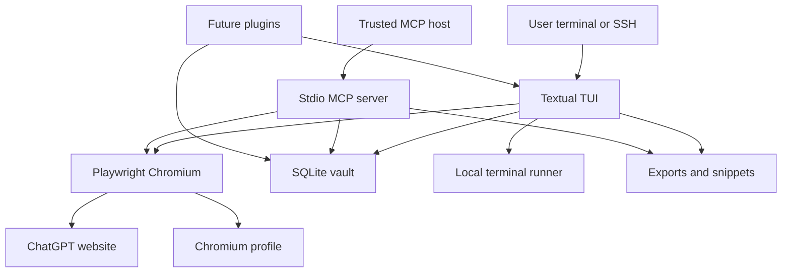

# Chatalyst Threat Model

## Executive summary

Chatalyst's highest-risk areas are the local ChatGPT browser profile, the SQLite
knowledge vault, MCP automation access, and reviewed local terminal/snippet
execution. The expected deployment is single-user local or SSH/LAN-adjacent use,
not direct internet exposure. The main security objective is therefore to keep
local sensitive data private, prevent accidental remote write/execution paths,
and make future plugin/network features deny-by-default.

## Scope and assumptions

- In scope: `chatalyst/app.py`, `chatalyst/core/`, `chatalyst/widgets/`, `pyproject.toml`, `.gitignore`, and `README.md`.
- Out of scope: ChatGPT's service security, OpenAI account controls, OS account
  compromise, and future plugin implementations that are not present yet.
- Assumption: Chatalyst will run as a single-user local or SSH-accessed app on a
  trusted host; it may be reachable indirectly on a LAN through SSH, terminal
  sharing, or an MCP host.
- Assumption: cached conversations, notes, exports, snippets, logs, and the
  Chromium profile are highly sensitive.
- Assumption: the MCP server remains stdio-only unless wrapped by another tool.

Open questions that could change risk ranking:

- If MCP is later exposed as a network daemon, authentication, authorization,
  transport security, and audit logging become high-priority requirements.
- If multiple OS users share the same host/workspace, local filesystem isolation
  and workspace ownership checks become more important.

## System model

### Primary components

- Textual TUI entrypoint and command parser: `chatalyst/app.py` handles `--offline`,
  `--headless`, `--mcp`, terminal commands, notes, tags, snippets, and prompt
  sending. Evidence: `chatalyst/app.py:368-409`, `chatalyst/app.py:497-573`.
- Browser service: Playwright persistent Chromium profile, optimized for
  ChatGPT and source-of-truth extraction. Evidence: `chatalyst/core/browser.py:216-263`.
- Extraction service: DOM-based ChatGPT conversation discovery, message
  extraction, streaming, and display pruning. Evidence: `chatalyst/core/chatgpt.py`.
- Local vault: SQLite stores conversations, messages, notes, tags, bookmarks,
  exports, snippets, and FTS index. Evidence: `chatalyst/core/cache.py:69-177`.
- MCP stdio server: automation access to local vault search/read/export/snippet
  staging plus live ChatGPT send/reply tools in full mode, including optional
  default conversation/project scoping for live tools, with read-only and
  size controls. Evidence: `chatalyst/core/mcp_server.py:34-61`,
  `chatalyst/core/mcp_server.py:333-344`.
- Terminal/snippet runner: local subprocess execution without shell expansion,
  with timeout and output caps. Evidence: `chatalyst/core/terminal.py:33-93`,
  `chatalyst/core/snippets.py:71-93`.
- Plugin hook registry: future in-process extension seam with cache/config
  access. Evidence: `chatalyst/core/plugins.py:12-89`.

### Data flows and trust boundaries

- User terminal -> TUI:
  - Data: prompts, slash commands, tags, notes, terminal commands.
  - Channel: local terminal or SSH terminal.
  - Security guarantees: OS user account boundary; runtime lock for one owner.
  - Validation: command routing in `chatalyst/app.py:368-409`; terminal command parsing
    via `shlex` in `chatalyst/core/terminal.py:51-59`.

- TUI -> Chromium/ChatGPT:
  - Data: prompts, authenticated session state, DOM-extracted messages.
  - Channel: Playwright persistent Chromium over HTTPS to ChatGPT.
  - Security guarantees: real authenticated browser session, no OpenAI API keys,
    no private backend API usage.
  - Validation: DOM selectors and visible-browser interactions; selectors can
    fail closed into diagnostics.

- Chromium profile -> local filesystem:
  - Data: cookies/session state and browser profile files.
  - Channel: local files under `profile/chromium/`.
  - Security guarantees: owner-only runtime directories after hardening.
  - Validation: path is derived from workspace config, not user-supplied per file.

- Extraction/cache -> SQLite vault:
  - Data: conversation titles, messages, notes, tags, bookmarks, snippets,
    exports metadata.
  - Channel: local SQLite file.
  - Security guarantees: parameterized SQL and owner-only database file after
    hardening. Evidence: `chatalyst/core/cache.py:55-63`.
  - Validation: Pydantic models normalize application data.

- MCP client -> MCP stdio server -> SQLite vault:
  - Data: JSON-RPC requests, search queries, conversation IDs, export/snippet
    requests, project names, live ChatGPT prompts.
  - Channel: stdin/stdout stdio, optionally launched by an MCP host.
  - Security guarantees: no terminal execution or raw browser control; optional
    read-only mode; request and text-size caps.
  - Validation: JSON object checks, method/tool allowlist, bounded strings,
    limits. Evidence: `chatalyst/core/mcp_server.py:66-114`, `chatalyst/core/mcp_server.py:307-330`,
    `chatalyst/core/mcp_server.py:333-344`.

- TUI/MCP -> exports/snippets:
  - Data: selected messages, entire conversations, staged code/text snippets.
  - Channel: local files under `exports/` and `work/snippets/`.
  - Security guarantees: owner-only directories and private export/snippet files.
  - Validation: export format enum and snippet run-mode mapping.

- Future plugins -> application cache/config:
  - Data: cache contents, search results, export hooks, config paths.
  - Channel: in-process Python hooks.
  - Security guarantees: none beyond local code trust; no plugin loader exists
    yet.
  - Validation: not yet applicable.

#### Diagram

## Assets and security objectives

| Asset | Why it matters | Security objective (C/I/A) |
|---|---|---|
| Chromium profile | Contains authenticated ChatGPT session state | C/I |
| SQLite vault | Stores sensitive conversations, notes, tags, bookmarks | C/I/A |
| Exports | Portable copies of sensitive conversations | C |
| Snippets | May contain code, secrets, or operational commands | C/I |
| Terminal runner | Can execute local commands as the user | I/A |
| MCP server | Automation surface for reading and writing vault artifacts | C/I/A |
| Logs | May contain diagnostics and error text from sensitive workflows | C |
| Plugin hooks | Future in-process extension point with cache/config access | C/I/A |
| `uv.lock` dependencies | Controls supply-chain inputs | I/A |

## Attacker model

### Capabilities

- LAN user who can reach an SSH session, shared terminal, or MCP bridge if the
  operator exposes one.
- Local process running as the same OS user, including an MCP host or plugin the
  user installed.
- Malicious or compromised ChatGPT conversation content that suggests commands
  or code snippets to run.
- Web content loaded in the authenticated Chromium browser.

### Non-capabilities

- No direct internet access to Chatalyst is expected.
- No remote HTTP API or network listener exists in the current repo.
- MCP does not expose terminal execution or raw browser automation; full MCP mode
  can ask Chatalyst to create a new ChatGPT chat or reply in a cached
  conversation through the service layer. New-chat requests may be scoped to a
  visible ChatGPT project through `--mcp-default-project` or a per-call
  `project_name`.
- An attacker is not assumed to already control the OS user account; if they do,
  the browser profile and vault are already compromised.

## Entry points and attack surfaces

| Surface | How reached | Trust boundary | Notes | Evidence |
|---|---|---|---|---|
| CLI flags | `uv run chatalyst ...` | User terminal -> app config | Controls workspace, offline, MCP, headless modes | `chatalyst/app.py:497-573` |
| TUI prompt input | Textual input box | User terminal -> app logic | Sends prompts, notes, tags, terminal commands, snippets | `chatalyst/app.py:368-409` |
| Terminal command runner | `/terminal ...` | User intent -> local subprocess | No shell expansion; still executes local programs | `chatalyst/core/terminal.py:51-67` |
| Snippet runner | staged snippet panel | Cached/chat text -> local subprocess after user action | Bash/Python snippets can run as the user | `chatalyst/core/snippets.py:71-93` |
| MCP stdio | MCP host stdin/stdout | MCP host -> vault/files/browser service | Read-only mode exists; live send/reply tools are omitted in read-only mode | `chatalyst/core/mcp_server.py:34-61` |
| MCP request parser | JSON-RPC lines | MCP host -> parser | Object/type/size checks | `chatalyst/core/mcp_server.py:333-344` |
| Browser automation | Playwright Chromium | Local app -> ChatGPT website | Persistent authenticated browser profile | `chatalyst/core/browser.py:216-263` |
| SQLite vault | local DB file | app -> filesystem | Owner-only DB after hardening | `chatalyst/core/cache.py:55-63` |
| Export writer | export command or MCP tool | vault -> filesystem | Private export files after hardening | `chatalyst/core/export.py:40-63` |
| Plugin hooks | future registry | local plugin code -> app internals | No loader yet; future trust boundary | `chatalyst/core/plugins.py:44-89` |

## Top abuse paths

1. Attacker gains access to a LAN-exposed MCP bridge, calls read tools, and
   exfiltrates cached sensitive conversations from the vault.
2. Attacker gains access to a full MCP bridge, sends prompts into the user's
   authenticated ChatGPT account or replies in existing conversations.
3. Attacker gains access to a write-capable MCP bridge, stages many large
   snippets or exports to consume disk or create confusing local artifacts.
4. Malicious ChatGPT content convinces a user to stage and run a shell/Python
   snippet, causing local command execution under the user's account.
5. Another local OS user reads a permissively-created vault, export, snippet, or
   browser profile file and extracts conversation data or session state.
6. A future plugin receives unrestricted cache/config access and leaks vault
   contents to a local file search, network integration, or external service.
7. Browser selector drift causes extraction failures; diagnostic text may expose
   sensitive URLs or workflow details in logs or the TUI.
8. Dependency compromise in Playwright/Textual/Markdown/Rich stack affects local
   execution, rendering, or browser automation integrity.

## Threat model table

| Threat ID | Threat source | Prerequisites | Threat action | Impact | Impacted assets | Existing controls (evidence) | Gaps | Recommended mitigations | Detection ideas | Likelihood | Impact severity | Priority |
|---|---|---|---|---|---|---|---|---|---|---|---|---|
| TM-001 | LAN user or compromised MCP host | MCP is bridged or launched by a tool reachable beyond the user's trusted session | Read cached conversations, notes, bookmarks, and tags through MCP | Sensitive knowledge-vault disclosure | SQLite vault, notes, bookmarks | MCP is stdio-only and has read-only mode (`chatalyst/core/mcp_server.py:34-61`, `chatalyst/app.py:515-573`) | No authentication if a third-party bridge exposes stdio over the network | Use `--mcp-read-only` for bridged/LAN automation; require SSH or authenticated local MCP host; do not expose raw stdio bridge to untrusted LAN | Log MCP host command line externally; monitor unexpected export/snippet files | medium | high | high |
| TM-008 | LAN user or compromised MCP host | Full MCP mode is bridged or reachable beyond trusted automation and the browser profile is logged in | Send a new ChatGPT message or reply in an existing conversation as the user | Account misuse, unwanted content in conversation history, prompt/data leakage to ChatGPT | ChatGPT account, Chromium profile, vault | Live tools are omitted in read-only mode and use service-layer browser interactions rather than raw browser control | Full MCP mode trusts the MCP host and has no per-call human approval | Use full MCP mode only with trusted local/SSH MCP hosts; add optional per-tool allowlist or confirmation gate if a network bridge is introduced | Monitor new/recent conversations and Chatalyst sync logs for unexpected activity | medium | high | high |
| TM-002 | Local OS user or backup/sync tool | Runtime files are readable outside owner account or copied into shared storage | Read browser profile, DB, exports, snippets, or logs | ChatGPT session and conversation disclosure | Chromium profile, SQLite vault, exports, logs | Owner-only dirs/files after hardening (`chatalyst/core/config.py:83-94`, `chatalyst/core/cache.py:55-63`, `chatalyst/core/export.py:40-63`, `.gitignore:30-47`) | Existing files from older versions may retain weaker permissions | Add a repair command to chmod existing workspaces; document backup/sync exclusions | Periodic permission audit command; alert on world-readable runtime files | medium | high | high |
| TM-003 | Malicious chat content or copied code | User stages and approves a code block or `/terminal` command | Execute local code as the user | Local data modification or exfiltration | Terminal runner, snippets, vault, host files | No shell expansion and timeout/output caps (`chatalyst/core/terminal.py:33-93`); MCP cannot run terminal commands | No policy allowlist or extra confirmation for risky commands | Add optional command allowlist/denylist and "dangerous command" confirmation; keep MCP terminal execution disabled | Audit snippet run history and failed commands; review shell snippets before run | medium | high | high |
| TM-004 | Compromised or malicious future plugin | User installs/registers a plugin | Plugin reads/modifies cache or exports data | Vault disclosure or integrity compromise | Vault, exports, plugin hooks | Current registry has no dynamic loader (`chatalyst/core/plugins.py:44-89`) | No plugin permission model yet | Before implementing loaders, require manifest permissions, disabled-by-default network/file scopes, and per-plugin audit logs | Log plugin registration and hook activity | low | high | medium |
| TM-005 | MCP client or local process | Write-capable MCP is available | Send large request/body or many export/snippet calls | Disk or memory pressure, degraded availability | MCP server, exports, snippets, vault | Request/body caps and tool limits (`chatalyst/core/mcp_server.py:116-198`, `chatalyst/core/mcp_server.py:333-344`) | No rate limiting across multiple requests | Keep stdio local; add operation counters/rate limits if network bridge is added | Monitor export/snippet directory growth | low | medium | low |
| TM-006 | ChatGPT DOM or selector drift | ChatGPT UI changes or diagnostics include sensitive details | Selector failures or error reporting reveal URLs or text snippets locally | Local information disclosure in logs/TUI | Logs, diagnostics | Structured failure handling and local logs (`chatalyst/app.py:135-146`, `chatalyst/app.py:165-177`) | Logs are not redacted beyond being local/private | Avoid logging message bodies; keep logs owner-only; add redaction helpers before network logging exists | Review logs for conversation URLs/content during support | low | medium | low |
| TM-007 | Supply-chain attacker | Vulnerable or compromised dependency is installed | Abuse package execution, browser automation, or rendering path | Local compromise or vault disclosure | Dependencies, runtime host | Locked dependencies in `uv.lock`; `pip-audit` checked current env | No CI dependency audit in repo | Add `uvx pip-audit` or equivalent CI/manual release gate; consider Dependabot/Renovate | Dependency audit on release and before publish | low | high | medium |

## Criticality calibration

- Critical: direct internet-exposed unauthenticated access to vault/profile,
  remote terminal execution without user approval, or committed session data.
- High: LAN/bridged MCP read access to sensitive vault data, local world-readable
  profile/vault files, or snippet execution paths that bypass user review.
- Medium: future plugin access without a permission model, dependency audit gaps,
  or diagnostics that leak sensitive local metadata.
- Low: local DoS through repeated exports/snippets, selector drift causing local
  diagnostics, or best-practice gaps with strong local preconditions.

## Focus paths for security review

| Path | Why it matters | Related Threat IDs |
|---|---|---|
| `chatalyst/core/mcp_server.py` | Main automation boundary for vault access, live send/reply, and write-capable tools | TM-001, TM-005, TM-008 |
| `chatalyst/app.py` | CLI mode switches, TUI commands, MCP launch path, terminal/snippet actions | TM-001, TM-003 |
| `chatalyst/core/config.py` | Defines sensitive runtime directories and permission posture | TM-002 |
| `chatalyst/core/cache.py` | Stores all sensitive conversations, notes, bookmarks, snippets, exports | TM-001, TM-002 |
| `chatalyst/core/browser.py` | Owns authenticated Playwright Chromium profile | TM-002, TM-006 |
| `chatalyst/core/terminal.py` | Local command execution boundary | TM-003 |
| `chatalyst/core/snippets.py` | Stages and runs ChatGPT-derived code | TM-003, TM-005 |
| `chatalyst/core/plugins.py` | Future extension boundary with cache/config access | TM-004 |
| `.gitignore` | Prevents profile/vault/export/log data from being committed | TM-002 |
| `uv.lock` | Supply-chain review input | TM-007 |

## Quality check

- Covered discovered entry points: CLI, TUI prompt commands, MCP stdio, browser
  automation, SQLite vault, exports/snippets, terminal runner, plugin hooks.
- Covered each trust boundary at least once in threats.
- Separated runtime behavior from dependency/build hygiene and future plugins.
- Reflected user clarifications: LAN possible, sensitive cache yes, harden code.
- Assumptions and open questions are explicit.
